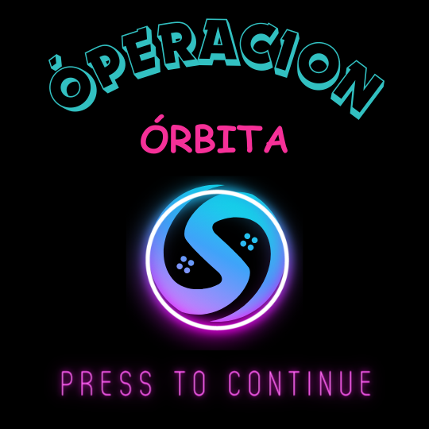
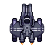

# Óperacion Órbita

## Equipo de desarrollo

- Gregorio Ondijan
- Franco Zelione
- Ramiro Villani
- Estaban Palmisano

## Capturas

 

## Instrucciones

### Menú de Selección:

- Utiliza la flecha hacia arriba (↑) o hacia abajo (↓) para navegar por las opciones del menú.
- Presiona la tecla "Enter" para seleccionar la opción deseada.

### Nivel 1 - Navegación Lateral:

- Maneja la nave utilizando las teclas de flecha hacia la izquierda (←) o hacia la derecha (→) para desplazarte lateralmente en el escenario.
- Presiona la barra espaciadora para disparar a los enemigos y obstáculos.

### Nivel 2 y 3 - Navegación en Cuatro Direcciones:

- Controla la nave utilizando las teclas de flecha hacia arriba (↑), hacia abajo (↓), hacia la izquierda (←) o hacia la derecha (→) para desplazarte en todas las direcciones del escenario.
- En estos niveles, la nave exhibirá animaciones fluidas que corresponden con todos los movimientos realizados, incluido el ascenso y descenso.
- Continúa utilizando la barra espaciadora para efectuar disparos hacia los enemigos y obstáculos en tu camino

## Reglas

## Otros

- Paradigmas De Programacion - Curso k2004 - UTN-FRBA
- Versión de wollok
- Una vez terminado, no tenemos problemas en que el repositorio sea público / queremos manternerlo privado
